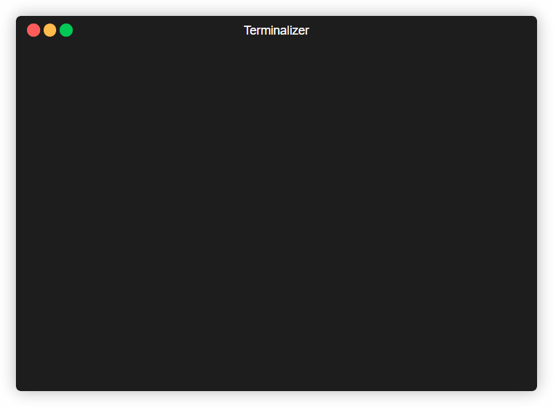
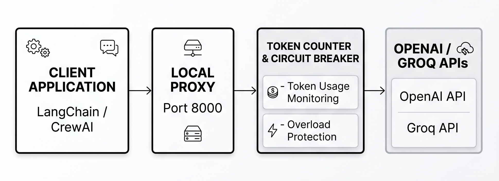

# LLM Budget Guard
[](https://github.com/preettrank53/llm-circuit-breaker/actions)

**GitHub Repository:** [https://github.com/preettrank53/llm-circuit-breaker](https://github.com/preettrank53/llm-circuit-breaker)

A local circuit breaker to stop multi-agent workflows from bankrupting your OpenAI API limits.

<p align="center">
  
</p>

## Architecture & Data Flow

<p align="center">
  
</p>

<p align="center">
  
</p>

## Installation & Quickstart

You can run the circuit breaker natively via Python or as an isolated Docker container.

### Option 1: Native Python (CLI)

1. **Install the package:**
   ```bash
   pip install llm-circuit-breaker
   ```
2. **Set your credentials:**
   Create a `.env` file in your working directory:
   ```env
   UPSTREAM_BASE_URL=https://api.openai.com/v1
   UPSTREAM_API_KEY=your_actual_api_key_here
   ```
3. **Start the server:**
   ```bash
   circuit-breaker
   ```

### Option 2: Docker Compose

1. **Set your credentials:** Create a `.env` file as shown above.
2. **Start the container:**
   ```bash
   docker-compose up -d
   ```

## Usage & Framework Integrations

Point your AI agent's base URL to the local proxy (`http://localhost:8000/v1`). It will automatically intercept requests, check your budget, and forward them safely.

We have included drop-in examples for popular frameworks in the `examples/` directory:
- [LangChain Integration](examples/langchain_demo.py)
- [CrewAI Integration](examples/crewai_demo.py)

### Standard OpenAI SDK Example

```python
from openai import OpenAI

client = OpenAI(
    base_url="http://localhost:8000/v1",
    api_key="dummy-key" # Proxy injects your real key automatically
)

response = client.chat.completions.create(
    model="gpt-3.5-turbo",
    messages=[{"role": "user", "content": "Say hello"}],
    stream=False # Streaming not supported yet
)
print(response.choices[0].message.content)
```

## Management API

Control your budget programmatically via simple HTTP endpoints:

- **Check Budget Status:** `GET /v1/budget`
- **Reset Token Counter:** `POST /v1/budget/reset`

## Performance Benchmark

The proxy uses an asynchronous connection pool via FastAPI's `lifespan` architecture, meaning it holds the SSL handshake open. In a small five-request smoke test, end-to-end latency was within normal network variance.

```text
Starting benchmark...
Measuring DIRECT latency (5 requests)...
Average Direct Latency: 473.53 ms

Measuring PROXY latency (5 requests)...
Average Proxy Latency:  470.80 ms

Total Proxy Overhead: -2.73 ms
```
